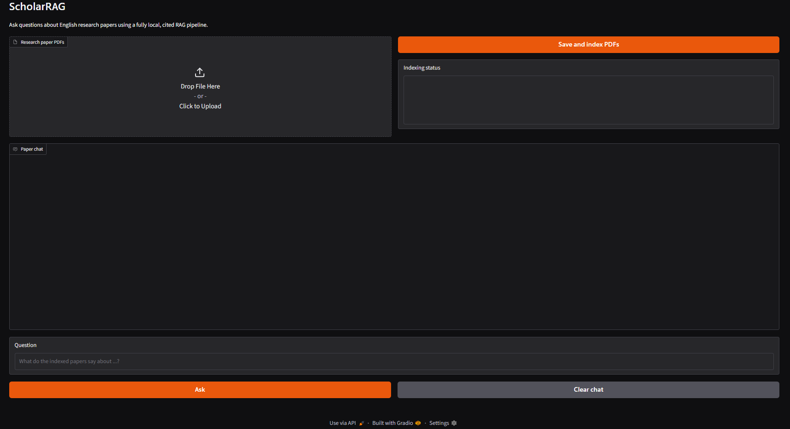
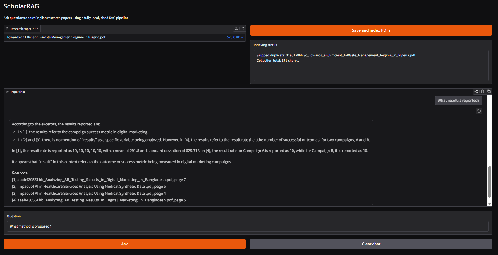

# ScholarRAG

## A Local Citation-Grounded Research Paper Q&A Chatbot

ScholarRAG is a private, fully local application for asking questions about English research papers. Upload a PDF, let ScholarRAG index its contents, and ask questions in a simple web interface. Answers are generated by a local Ollama model and include the source PDF and page numbers used as evidence.

No paid API or cloud LLM is required. Your papers, vector database, questions, and generated answers remain on your device.

## Key Features

- Upload one or more English research paper PDFs.
- Extract text while preserving page numbers.
- Split paper text into coherent, overlapping chunks.
- Generate embeddings locally with `sentence-transformers/all-MiniLM-L6-v2`.
- Store and search embeddings in a persistent ChromaDB vector database.
- Ask questions through a beginner-friendly Gradio interface.
- Generate streamed answers with the local Ollama model `llama3.2:3b`.
- Display source citations with PDF names and page numbers.
- Evaluate retrieval with Page Hit@K and mean reciprocal rank (MRR).
- Keep PDFs, uploaded files, prompts, settings, and generated data out of Git.

## Demo Screenshots

### Initial View



### Question and Answer View



## System Architecture

```text
PDF Upload
    ↓
PDF Text Extraction with Page Numbers
    ↓
Boundary-Aware Text Chunking
    ↓
Local Embedding Generation
    ↓
ChromaDB Vector Storage
    ↓
User Question
    ↓
Semantic Retrieval
    ↓
Grounded Prompt Construction
    ↓
Ollama Local LLM
    ↓
Answer + Paper/Page Citations
```

## How It Works

1. **Upload:** The user uploads a text-based English research paper.
2. **Extract:** PyMuPDF reads the text and keeps its 1-based PDF page number.
3. **Chunk:** The text is divided into smaller overlapping passages without mixing pages.
4. **Embed:** Sentence Transformers converts each passage into a numerical vector locally.
5. **Store:** ChromaDB saves the passages, vectors, paper names, and page numbers.
6. **Retrieve:** The user's question is embedded and matched with the closest passages.
7. **Answer:** The retrieved evidence is sent to the local Ollama model.
8. **Cite:** ScholarRAG streams the answer and lists the PDF pages used as sources.

## Technology Stack

| Technology | Purpose |
|---|---|
| Python | Application language |
| Gradio | Local web-based chat interface |
| PyMuPDF | PDF text and page extraction |
| Sentence Transformers | Local embedding generation |
| `all-MiniLM-L6-v2` | Embedding model |
| ChromaDB | Persistent local vector database |
| Ollama | Local LLM runtime |
| `llama3.2:3b` | Default answer-generation model |
| pandas / scikit-learn | Evaluation and supporting data operations |

## Project Structure

```text
ScholarRAG-ChatBot/
├── app.py                      # Gradio application
├── ingest.py                   # Command-line PDF ingestion
├── evaluate.py                 # Retrieval evaluation
├── requirements.txt            # Python dependencies
├── .env.example                # Safe configuration template
├── data/
│   ├── papers/                 # PDFs added manually
│   └── evaluation/             # Private evaluation CSV
├── src/
│   ├── config/                 # Paths and settings
│   ├── pdf/                    # PDF extraction
│   ├── preprocessing/          # Text chunking
│   ├── embeddings/             # Local embedding model
│   ├── vectordb/               # ChromaDB operations
│   ├── llm/                    # Ollama HTTP client
│   ├── rag/                    # Retrieval, prompts, and RAG pipeline
│   └── evaluation/             # Evaluation metrics
├── storage/
│   ├── chroma_db/              # Private local vector database
│   └── uploaded_papers/        # Private Gradio uploads
├── outputs/                    # Results, screenshots, and logs
└── tests/                      # Offline automated tests
```

## Installation for Non-Technical Users

These instructions describe a first-time Windows setup. Run commands in PowerShell.

### 1. Install the required programs

Install:

- [Python 3.12](https://www.python.org/downloads/)
- [Git](https://git-scm.com/downloads)
- [Ollama](https://ollama.com/)

During Python installation, enable **Add Python to PATH**.

Confirm the programs are available:

```powershell
python --version
git --version
ollama --version
```

### 2. Download ScholarRAG

```powershell
git clone https://github.com/ShajibEwuCse19/ScholarRAG-ChatBot.git
cd ScholarRAG-ChatBot
```

### 3. Create the Python environment

```powershell
python -m venv .venv
.\.venv\Scripts\Activate.ps1
```

After activation, `(.venv)` should appear at the beginning of the PowerShell prompt.

If PowerShell blocks activation, run this once in the current window and try again:

```powershell
Set-ExecutionPolicy -Scope Process Bypass
.\.venv\Scripts\Activate.ps1
```

### 4. Install Python dependencies

```powershell
python -m pip install -r requirements.txt
```

### 5. Create the private settings file

```powershell
Copy-Item .env.example .env
```

The default settings already use `llama3.2:3b` and `all-MiniLM-L6-v2`. Most users do not need to edit `.env`.

## Ollama Setup

Open Ollama, then download the local model:

```powershell
ollama pull llama3.2:3b
ollama list
```

The Ollama Windows application normally keeps its local service running. If it is not running, keep this command open in a separate PowerShell window:

```powershell
ollama serve
```

Ollama is required for generated answers. PDF ingestion, retrieval evaluation, and automated tests can run without it.

## Run the Application

Activate the environment whenever you open a new PowerShell window:

```powershell
cd C:\path\to\ScholarRAG-ChatBot
.\.venv\Scripts\Activate.ps1
```

Start ScholarRAG:

```powershell
python app.py
```

Open this address in a browser:

```text
http://127.0.0.1:7860
```

### Upload and ask questions

1. Select one or more English PDF files.
2. Click **Save and index PDFs**.
3. Wait until the status shows page and chunk counts.
4. Type a question and click **Ask**.
5. Read the streamed answer and verify its paper/page sources.
6. Stop the application with `Ctrl+C` in PowerShell.

The first indexing run can take longer because the embedding model downloads once and is then cached locally.

When several papers are indexed, include the paper title in questions that use phrases such as “this paper” or “the paper.” This prevents ambiguity.

## Optional Command-Line Ingestion

Instead of uploading through Gradio, place PDFs in `data/papers` and run:

```powershell
python ingest.py
```

To ingest one specific PDF:

```powershell
python ingest.py --input ".\data\papers\your-paper.pdf"
```

Running ingestion again skips identical documents.

## Example Questions

```text
What is the main contribution of "Paper Title"?
What dataset was used in the experiment?
What methodology did the authors follow?
What are the limitations of the study?
Summarize "Paper Title" in simple terms.
What are the key results reported in "Paper Title"?
```

## Example Answer Format

```text
The paper's main contribution is ... [1]

Sources
[1] paper_name.pdf, page 3
[2] paper_name.pdf, page 5
```

The exact wording depends on the retrieved passages and the local LLM response.

## Start Again with an Empty Index

Stop `app.py` with `Ctrl+C`, then remove only private runtime data:

```powershell
Get-ChildItem .\storage\chroma_db -Force |
  Where-Object Name -ne '.gitkeep' |
  Remove-Item -Recurse -Force

Get-ChildItem .\storage\uploaded_papers -Force |
  Where-Object Name -ne '.gitkeep' |
  Remove-Item -Recurse -Force
```

Restart with `python app.py`. PDFs manually placed in `data/papers` are not deleted.

## Automated Tests

The tests use generated PDFs, temporary Chroma collections, fake embeddings, and a fake LLM. They do not upload data or require Ollama:

```powershell
python -m unittest discover -s tests -v
```

All tests should report `ok`.

Optional integrity checks:

```powershell
python -m compileall -q app.py ingest.py evaluate.py src tests
python -m pip check
```

## Retrieval Evaluation

Create the private file `data/evaluation/qa_dataset.csv`:

```csv
question,expected_paper,expected_page
What method is proposed?,example.pdf,3
What result is reported?,example.pdf,5
```

Use exact PDF filenames and 1-based page numbers, then run:

```powershell
python evaluate.py
```

The current script reports:

- **Page Hit@K:** whether the expected paper/page appears in the top retrieved results.
- **Hit rate:** the proportion of questions with a successful page hit.
- **MRR:** how highly the first correct paper/page is ranked.

Detailed results are stored privately in `outputs/results/retrieval_results.csv`.

Evaluation results will be added after running the retrieval evaluation script on a manually prepared QA dataset. No evaluation score is claimed in this repository.

Answer faithfulness, retrieval quality, and response latency can also be reviewed manually during testing, but they are not currently calculated by `evaluate.py`.

## Privacy

ScholarRAG is designed to run locally. `.gitignore` excludes:

- `.env` and private prompt notes
- Python virtual environments
- Research paper PDFs and uploaded papers
- Evaluation datasets
- ChromaDB runtime data
- Generated results and logs

Always review `git status` before pushing changes.

## Limitations

- Works best with text-based PDFs; scanned documents do not have OCR support yet.
- Complex tables, equations, and multi-column layouts may not extract perfectly.
- Answer quality depends on retrieval quality and the local model.
- Generic questions such as “What is the contribution of the paper?” are ambiguous when multiple papers are indexed; include the title.
- Uploaded-paper citation names currently include a short storage hash prefix.
- Optimized for English research papers.
- Large paper collections require additional memory, storage, and indexing time.

## Future Work

- Add OCR for scanned PDFs.
- Add a paper-selection control for unambiguous multi-paper questions.
- Preserve cleaner display names for uploaded-paper citations.
- Add multi-paper comparison and filtering.
- Add section detection for Abstract, Methodology, Results, and Conclusion.
- Add RAGAS-based advanced evaluation.
- Add downloadable chat history.
- Support larger local Ollama models.

## Troubleshooting

| Problem | Solution |
|---|---|
| `python` is not recognized | Reinstall Python and enable **Add Python to PATH**. |
| Environment activation is blocked | Run `Set-ExecutionPolicy -Scope Process Bypass`, then activate again. |
| `ollama` is not recognized | Install Ollama and reopen PowerShell. |
| Cannot reach Ollama | Open Ollama or run `ollama serve`. |
| Model is not installed | Run `ollama pull llama3.2:3b`. |
| No PDF files found | Upload through Gradio or place PDFs under `data/papers`. |
| No papers are indexed | Click **Save and index PDFs** or run `python ingest.py`. |
| The answer says evidence is insufficient | Include the paper title and ask a more specific question. |

## Portfolio Summary

**ScholarRAG:** Developed a fully local citation-grounded RAG chatbot for English research paper question answering using PDF parsing, semantic chunk retrieval, ChromaDB vector search, Ollama-based local LLM inference, and Gradio UI.

## Author

**ShajibEwuCse19**

- GitHub: [github.com/ShajibEwuCse19](https://github.com/ShajibEwuCse19)
- Project repository: [ScholarRAG-ChatBot](https://github.com/ShajibEwuCse19/ScholarRAG-ChatBot)
